# 🧙‍♂️ Workromancer

> **Employee knowledge, immortalized. Even when they leave.**

Workromancer is an open-source AI-powered knowledge preservation platform that captures, contextualizes, and preserves your organization's institutional knowledge. When employees leave, their expertise doesn't have to.

🚀 Live Demo(Comming Soon) · 📖 Documentation](Comming Soon) · 💬 Community(Comming Soon) · [🐛 Report Bug](https://github.com/workromancer/workromancer.ai/issues)

---

## 📋 Table of Contents

- [The Problem](#-the-problem)
- [The Solution](#-the-solution)
- [Key Features](#-key-features)
- [How It Works](#-how-it-works)

---

## 🚨 The Problem

Every time a key employee leaves your organization, critical knowledge walks out the door with them:

- **💔 Knowledge Drain**: Years of institutional knowledge, project context, and decision-making rationale disappear forever
- **📉 Stalled Projects**: Teams struggle without understanding the 'why' behind past decisions, leading to delays and costly mistakes
- **⏰ Inefficient Onboarding**: New hires spend months piecing together context that could have been preserved instantly

---

## 💡 The Solution

**Workromancer is your institutional memory, supercharged by AI.**

Our platform captures and contextualizes the collective knowledge of your employees, making it instantly accessible and actionable—long after they're gone.

### Core Principles

- 🧠 **AI-Powered Learning**: Continuously learns from team work patterns, decisions, and communications
- 🔒 **Secure Knowledge Preservation**: Enterprise-grade security for your intellectual property
- ⚡ **Instant Knowledge Access**: Get context-rich answers as if consulting the original employee

---

## ✨ Key Features

### 🔌 Seamless Integrations

Connect effortlessly to the tools your team already uses:

- **Project Management**: Jira, Asana, Linear, Notion
- **Communication**: Slack, Teams, Discord, Zoom
- **Development**: GitHub, GitLab, Figma
- **Documentation**: Confluence, Google Drive, Dropbox
- **And 100+ more** - Don't see your tool? We'll add it!

### 🤖 AI-Powered Knowledge Bots

Get dedicated AI bots trained on each employee's:
- Unique work style and approach
- Project history and context
- Decision-making rationale
- Best practices and workflows

Ask questions like:
- "How did Sarah handle the client integration issue?"
- "What was Mike's approach to optimizing the database?"
- "Why did the team choose this technical architecture?"

## 🔄 How It Works

```mermaid
graph LR
    A[1️⃣ Integrate & Learn] --> B[2️⃣ Preserve & Analyze]
    B --> C[3️⃣ Access & Utilize]
    
    style A fill:#2d5f4f,stroke:#3dd68c,stroke-width:2px,color:#fff
    style B fill:#2d5f5f,stroke:#3dd68c,stroke-width:2px,color:#fff
    style C fill:#2d5f6f,stroke:#3dd68c,stroke-width:2px,color:#fff
```

---

## Contact

Made by the Workromancer

[Website](https://workromancer.ai) • [LinkedIn](https://linkedin.com/in/workromancer) • [Threads](https://threads.com/workromancer)